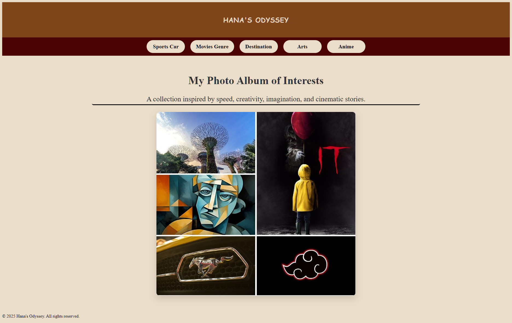
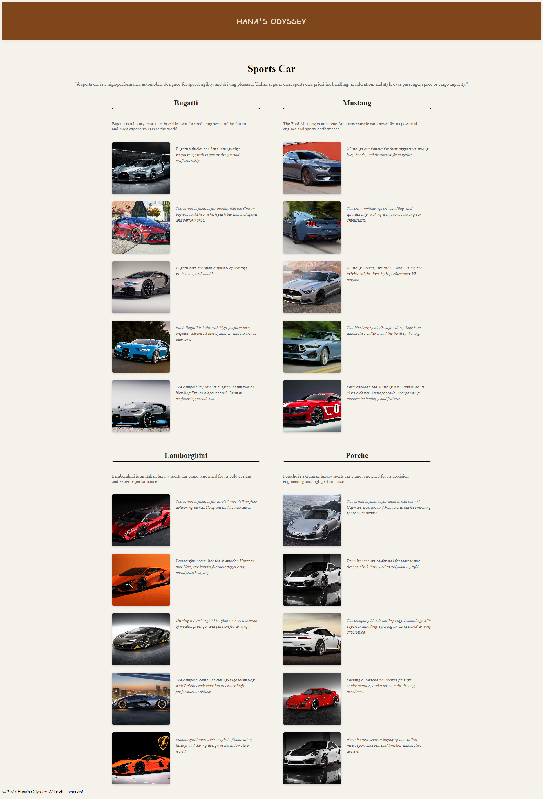
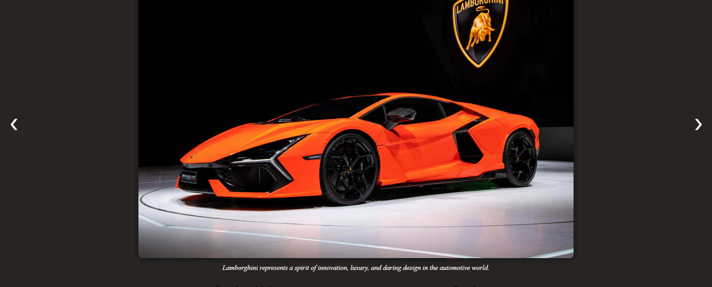
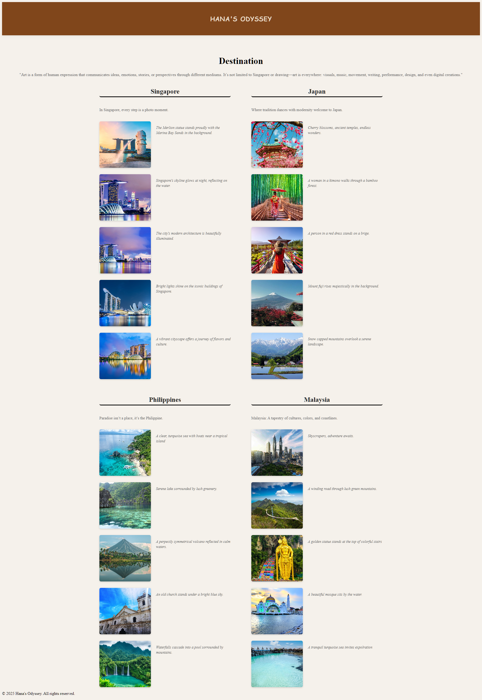
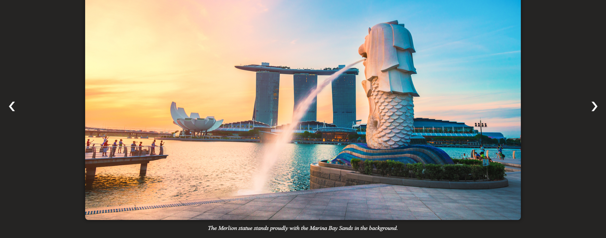
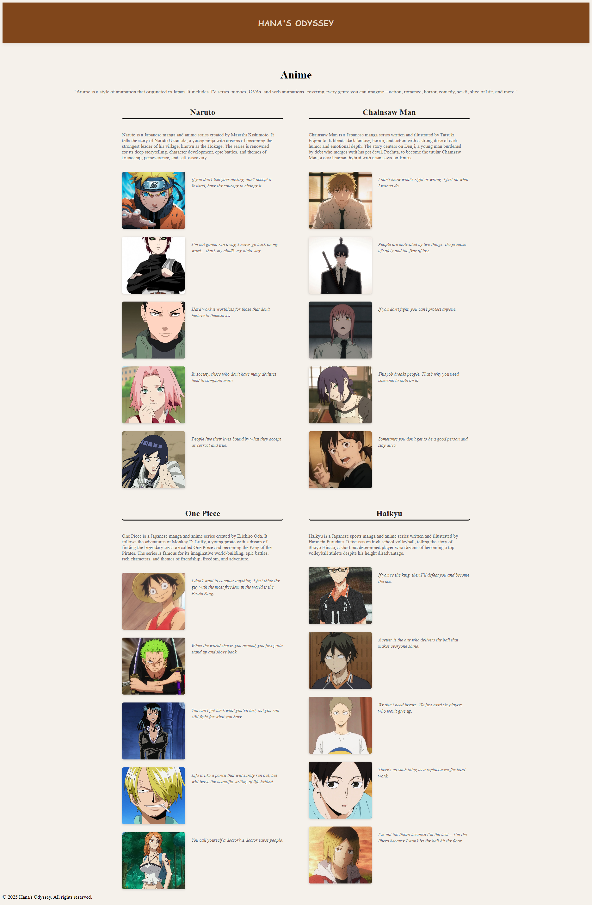
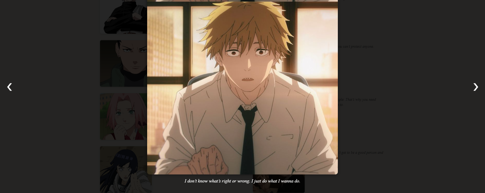

## **Program:** Bachelor of Science in Information Technology

## **Activity Title:** LAB ACTIVITY: PHOTO ALBUM WEB APPLICATION (LARAVEL FRAMEWORK)

## **Name:** Johanna Bagarinao

## Project Overview

This is a **Photo Album Web Application** built using **Laravel Framework**. The project showcases popular anime series, presenting descriptions, images, and memorable quotes from each anime. The page is organized in a **two-column layout**, with multiple categories and images in each category.

## Anime Page Overview

-   **Caption:**  
    _"Anime is a style of animation that originated in Japan. It includes TV series, movies, OVAs, and web animations, covering every genre you can imagine—action, romance, horror, comedy, sci-fi, slice of life, and more."_

-   **Layout:** Two columns
    -   **Left Column:** First two anime categories
    -   **Right Column:** Last two anime categories

Each category contains:

-   Anime title
-   Description
-   Image gallery with captions or quotes

## Categories

### 1. Naruto (Left Column)

-   **Description:** Follows Naruto Uzumaki, a young ninja aiming to become Hokage. Themes include friendship, perseverance, and self-discovery.
-   **Images & Quotes:**
    -   "If you don’t like your destiny, don’t accept it. Instead, have the courage to change it."
    -   "I’m not gonna run away, I never go back on my word… that’s my nindō: my ninja way."
    -   "Hard work is worthless for those that don’t believe in themselves."
    -   "In society, those who don’t have many abilities tend to complain more."
    -   "People live their lives bound by what they accept as correct and true."

### 2. One Piece (Left Column)

-   **Description:** Follows Monkey D. Luffy and his pirate crew as they search for the legendary treasure, One Piece. Themes include friendship, freedom, and adventure.
-   **Images & Quotes:**
    -   "I don’t want to conquer anything. I just think the guy with the most freedom in the world is the Pirate King."
    -   "When the world shoves you around, you just gotta stand up and shove back."
    -   "You can’t get back what you’ve lost, but you can still fight for what you have."
    -   "Life is like a pencil that will surely run out, but will leave the beautiful writing of life behind."
    -   "You call yourself a doctor? A doctor saves people."

### 3. Chainsaw Man (Right Column)

-   **Description:** Follows Denji, a young man who becomes a devil-human hybrid named Chainsaw Man. Themes include dark fantasy, action, humor, and emotional depth.
-   **Images & Quotes:**
    -   "I don’t know what’s right or wrong. I just do what I wanna do."
    -   "People are motivated by two things: the promise of safety and the fear of loss."
    -   "If you don’t fight, you can’t protect anyone."
    -   "This job breaks people. That’s why you need someone to hold on to."
    -   "Sometimes you don’t get to be a good person and stay alive."

### 4. Haikyu (Right Column)

-   **Description:** Focuses on high school volleyball, following Shoyo Hinata as he aims to become a top player. Themes include teamwork, dedication, and determination.
-   **Images & Quotes:**
    -   "If you’re the king, then I’ll defeat you and become the ace."
    -   "A setter is the one who delivers the ball that makes everyone shine."
    -   "We don’t need heroes. We just need six players who won’t give up."
    -   "There’s no such thing as a replacement for hard work."
    -   "I’m not the libero because I’m the best… I’m the libero because I won’t let the ball hit the floor."

## Arts Page Overview

-   **Caption:**  
    _"Art is a form of human expression that communicates ideas, emotions, stories, or perspectives through different mediums.  
    It’s not limited to painting or drawing—art is everywhere: visuals, music, movement, writing, performance, design, and even digital creations."_

-   **Layout:** Two columns
    -   **Left Column:** Painting, Drawing
    -   **Right Column:** Cubism, Graffiti

Each category contains:

-   Art form title
-   Description
-   Image gallery with captions

## Categories

### 1. Painting (Left Column)

-   **Description:** Painting is a visual art where artists use pigments on a surface to create images, express ideas, or convey emotions.
-   **Images & Captions:**
    -   Painting communicates feelings, stories, or perspectives visually.
    -   Application of color using brushes, knives, sponges, or fingers.
    -   Works created with oil, acrylic, watercolor, ink, or mixed media.
    -   Reflects traditions, beliefs, and historical experiences.
    -   Represents objects, people, landscapes, or abstract ideas.

### 2. Drawing (Left Column)

-   **Description:** Drawing uses lines, marks, and shapes to represent ideas, objects, or emotions.
-   **Images & Captions:**
    -   Using pencils, pens, charcoal, or digital styluses.
    -   Fundamental skill for planning, designing, and visualizing concepts.
    -   A visual language to communicate thoughts or stories.
    -   Precise representation for fields like engineering or design.
    -   Captures the appearance, form, and proportions of subjects.

### 3. Cubism (Right Column)

-   **Description:** Cubism is an early 20th-century art movement presenting subjects from multiple viewpoints simultaneously.
-   **Images & Captions:**
    -   Geometric shapes and fragmented forms abstract reality.
    -   Depicts the essence of objects from different angles.
    -   Rejects realistic representation in favor of form and structure.
    -   Developed mainly by Pablo Picasso and Georges Braque.
    -   Influenced modern art movements like Futurism and Constructivism.

### 4. Graffiti (Right Column)

-   **Description:** Graffiti is visual art created in public spaces using spray paint, markers, or stencils.
-   **Images & Captions:**
    -   Expresses identity, emotions, political views, or social messages.
    -   Often considered vandalism if done without permission.
    -   Communicates ideas and cultural symbols within communities.
    -   Part of hip-hop and urban art movements representing creativity.
    -   Techniques include tagging, murals, throw-ups, and street installations.

## Folder Structure

## Destination Page Overview

-   **Caption:**  
    _"A destination is a place, endpoint, or goal that someone or something is intended to reach."_

-   **Layout:** Two columns
    -   **Left Column:** Singapore, Philippines
    -   **Right Column:** Japan, Malaysia

Each category contains:

-   Destination title
-   Short description
-   Image gallery with captions

## Categories

### 1. Singapore (Left Column)

-   **Description:** In Singapore, every step is a photo moment.
-   **Images & Captions:**
    -   Merlion statue with Marina Bay Sands in the background.
    -   Skyline glowing at night, reflecting on the water.
    -   Modern architecture illuminated beautifully.
    -   Bright lights highlighting iconic buildings.
    -   Vibrant cityscape showcasing culture and cuisine.

### 2. Philippines (Left Column)

-   **Description:** Paradise isn’t a place, it’s the Philippines.
-   **Images & Captions:**
    -   Turquoise sea with boats near a tropical island.
    -   Serene lake surrounded by lush greenery.
    -   Symmetrical volcano reflected in calm waters.
    -   Historic church under a bright blue sky.
    -   Waterfalls cascading into mountain pools.

### 3. Japan (Right Column)

-   **Description:** Where tradition dances with modernity—welcome to Japan.
-   **Images & Captions:**
    -   Cherry blossoms, ancient temples, and scenic wonders.
    -   Woman in kimono walking through bamboo forest.
    -   Person in red dress standing on a bridge.
    -   Mount Fuji rising majestically in the background.
    -   Snow-capped mountains overlooking serene landscapes.

### 4. Malaysia (Right Column)

-   **Description:** Malaysia: A tapestry of cultures, colors, and coastlines.
-   **Images & Captions:**
    -   Skyscrapers and urban adventures.
    -   Winding road through lush green mountains.
    -   Golden statue atop colorful stairs.
    -   Beautiful mosque by the water.
    -   Tranquil turquoise sea inviting exploration.

## Folder Structure

## Movies Genre Page Overview

-   **Caption:**  
    _"A movie genre is a category that describes the general style, theme, and mood of a film. It tells us what kind of story to expect and how the film is likely to make us feel. Genres also help us group similar movies together."_

-   **Layout:** Two columns
    -   **Left Column:** Horror, Action
    -   **Right Column:** Comedy, Romance

Each category contains:

-   Genre title
-   Short description
-   Image gallery with captions illustrating iconic scenes or thematic elements

## Categories

### 1. Horror (Left Column)

-   **Description:** Reflects societal fears, human psychology, and moral questions through frightening stories.
-   **Images & Captions:**
    -   Paranormal investigators help a family terrorized by a dark presence.
    -   A grieving family uncovers terrifying secrets after tragedy.
    -   Family must live in silence to avoid deadly creatures hunting by sound.
    -   A cursed videotape brings death to anyone who watches it within seven days.
    -   Shape-shifting clown feeds on children’s fears in a small town.

### 2. Action (Left Column)

-   **Description:** Emphasizes physical excitement, fast-paced scenes, and daring stunts.
-   **Images & Captions:**
    -   Lone drifter and rebel warrior race across a desert fleeing a warlord.
    -   Retired hitman returns for revenge after criminals destroy the last thing he loves.
    -   Batman faces chaos unleashed by the Joker in Gotham City.
    -   Betrayed Roman general fights from slavery to challenge corrupt emperor.
    -   Ethan Hunt and team race to stop a global catastrophe after a failed mission.

### 3. Comedy (Right Column)

-   **Description:** Designed to make audiences laugh and entertain.
-   **Images & Captions:**
    -   Three friends retrace a wild night in Las Vegas before a wedding.
    -   Two teens make the most of their last high school days with a chaotic night out.
    -   Two middle-aged rivals become partners in chaotic adventures after parents marry.
    -   Two underachieving cops go undercover as high school students to bust a drug ring.
    -   Woman discovers her boyfriend is part of a wealthy family, leading to comedic culture clashes.

### 4. Romance (Right Column)

-   **Description:** Focuses on love stories and emotional relationships.
-   **Images & Captions:**
    -   Young couple falls in love but faces class differences and life challenges.
    -   Aspiring actress and jazz musician fall in love while pursuing dreams in LA.
    -   Forbidden romance blossoms between passengers on an ill-fated ship.
    -   Elizabeth Bennet navigates love and societal expectations with Mr. Darcy.
    -   Two teens with serious illnesses find love and meaning together.

## Folder Structure

## 1. Movies Genre Page

### Description

The Movies Genre page provides an overview of different movie genres. It explains how genres categorize films by style, theme, and mood. Each genre includes example movies with captions describing their plot or theme.

### Layout

The page is structured into two columns:

-   **Left Column**

    -   **Horror**
        -   Explores societal fears and psychological themes.
        -   Example movies include paranormal investigations, cursed videotapes, and monsters.
    -   **Action**
        -   Focuses on fast-paced excitement and stunts.
        -   Example movies include revenge plots, superhero challenges, and epic battles.

-   **Right Column**
    -   **Comedy**
        -   Designed to entertain and make audiences laugh.
        -   Example movies include wild adventures, chaotic rivalries, and humorous situations.
    -   **Romance**
        -   Centers on love stories and emotional relationships.
        -   Example movies include forbidden love, dramatic relationships, and coming-of-age romance.

Each category contains 5 images with descriptive captions highlighting the story or theme.

## 2. Sports Car Page

### Description

The Sports Car page highlights luxury and performance cars. Each category focuses on a specific car brand, emphasizing speed, design, and engineering excellence.

### Layout

The page is structured into two columns:

-   **Left Column**

    -   **Bugatti**
        -   Renowned for speed, luxury, and craftsmanship.
        -   Models include Chiron, Veyron, and Divo.
    -   **Lamborghini**
        -   Known for aggressive design and extreme performance.
        -   Models include Aventador, Huracán, and Urus.

-   **Right Column**
    -   **Mustang**
        -   Iconic American muscle car with powerful engines and sporty design.
        -   Models include GT and Shelby.
    -   **Porsche**
        -   German sports car brand famous for precision engineering and iconic models.
        -   Models include 911, Cayman, Boxster, and Panamera.

Each category contains 5 images with captions describing features, performance, and significance.

## **Features:**

    -   Laravel routing
    -   Blade templating
    -   Pagination / manual page navigation
    -   Custom CSS styling
    -   Proper folder structure
    -   Images properly displayed without missing links

## 🖥 Navigation

-   The header **“Hana's Odyssey”** acts as a **home button** on every page, allowing users to return to the Home Page easily.
-   "Clicking an image opens it in a larger view, where left and right navigation buttons allow users to smoothly browse through images, looping only within its category to keep browsing focused and organized."

## 📸 Project Screenshots

Here’s a preview of the **Photo Album Web Application**:

    <em>Home Page – Displays navigation links to all five categories.</em>
     
    
  

    <em>Sports Car Page – high-performance automobile designed for speed, agility, and driving pleasure.</em>
     
    
    
   
 

    <em>Movie Genre Page – describes the general style, theme, and mood of a film.</em>
     
    
    
   

    <em>Destination Page – A destination is a place, endpoint, or goal that someone or something is intended to reach.</em>
     
    
    
   
  

    <em>Arts Page – Art is a form of human expression that communicates ideas.</em>
     
    
    
 
  

    <em>Anime Page – Anime is a style of animation that originated in Japan. It includes TV seriess.</em>
     
    
    

